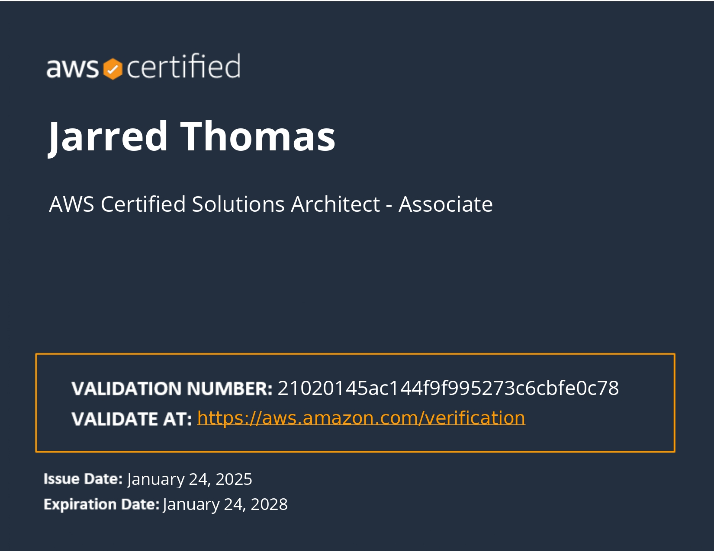
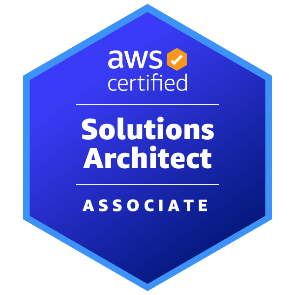

# AWS Solutions Architect Associate Certification Journey

This repository documents my journey through the preparation for the **AWS Certified Solutions Architect - Associate (SAA-C03)** exam. It includes hands-on projects, lessons learned, challenges faced, and any notes relevant to the certification process. This repository is intended for personal reference, and I hope it helps others following the same path as well.

    
    

---

### A Huge Thank You to Adrian Cantril

A special thank you goes to **Adrian Cantril**. His course and AWS project labs played an **indelible role** in helping me pass the AWS Certified Solutions Architect - Associate exam. Adrian’s content was instrumental in building my understanding of AWS and guiding me through complex topics with hands-on labs. I highly recommend his work to anyone pursuing this certification.

You can find his repository and additional resources here: [Adrian Cantril's GitHub](https://github.com/acantril).

---

## Exam Preparation

I documented my journey toward the AWS Certified Solutions Architect certification. You can find the full details of my exam preparation, lessons learned, and challenges faced in the following [AWS Solutions Architect Exam Preparation](AWS-Solutions-Architect-Exam-Preparation.md).

---

## About This Project

The **AWS Solutions Architect - Associate** certification validates your ability to design and implement distributed systems on AWS. The goal of this project is to document all the steps, from setting up AWS environments to deploying applications, while learning how AWS works in real-world scenarios.

This repository contains:
- Hands-on labs and exercises from the AWS Solutions Architect course.
- Sample configurations, scripts, and AWS services configurations.
- Challenges I faced and how I solved them.
- Insights and best practices that I gathered along the way.
- Documentation of important AWS services, architectures, and design patterns.

---

## Learning Path

This certification preparation consists of multiple stages. The lessons span across key AWS services and architecture best practices:

- **Lesson 1**: Basics of IAM, multi-factor authentication, and securing AWS accounts.
- **Lesson 2-10**: Core AWS services such as EC2, S3, CloudFormation, and IAM management.
- **Lesson 11-20**: Setting up multi-account organizations, VPCs, networking, and high availability.
- **Lesson 21-30**: Application deployment strategies, working with EC2 instances, RDS, and other AWS resources.
- **Lesson 31-40**: Advanced topics like encryption, CloudWatch monitoring, and scaling services.

Each lesson includes detailed explanations, code samples, and configuration files where applicable. The goal is to provide a comprehensive understanding of AWS services and how they can be combined to build scalable, secure systems.

---

## Challenges Faced

While going through the lessons, I encountered a few challenges:
- **IAM Policy Confusion**: Initially, I had trouble understanding the difference between managed and inline IAM policies. After hands-on practice and reviewing documentation, I gained a clearer understanding of their differences and best practices.
- **CloudFormation Templates**: Converting manual setups to CloudFormation scripts was challenging due to the verbosity and learning the syntax. With practice, I became more comfortable using CloudFormation for automated infrastructure deployment.
- **VPC Networking**: Setting up a multi-tier VPC architecture was complex, but it was crucial for understanding how AWS handles networking and security. Troubleshooting issues related to routing, NAT Gateways, and VPC Peering was invaluable in enhancing my overall networking skills.

---

## Key Technologies and AWS Services Covered

This certification journey touches on various essential AWS services and technologies:

- **IAM (Identity and Access Management)**: User and role management, policies, MFA (Multi-Factor Authentication).
- **EC2 (Elastic Compute Cloud)**: Instance provisioning, SSH access, scaling, load balancing.
- **S3 (Simple Storage Service)**: Object storage, bucket policies, static websites.
- **VPC (Virtual Private Cloud)**: Networking, subnets, Internet Gateways, NAT Gateways, security groups.
- **RDS (Relational Database Service)**: Relational databases, backups, migrations, multi-AZ deployments.
- **CloudFormation**: Infrastructure as code, stack management, automated provisioning.
- **CloudWatch**: Monitoring, alarms, logging, performance metrics.
- **EFS (Elastic File System)**: Scalable file storage solutions for web applications and multi-instance environments.
- **Elastic Load Balancer (ELB)**: Load balancing across EC2 instances for high availability.

---

## Final Thoughts

This journey has been incredibly rewarding. I’ve gained valuable insights into AWS services and learned the best practices for designing scalable, secure cloud architectures. I hope this repository serves as a helpful resource for others pursuing the AWS Certified Solutions Architect - Associate certification. Feel free to raise issues, ask questions, or contribute to improving this repository.

---