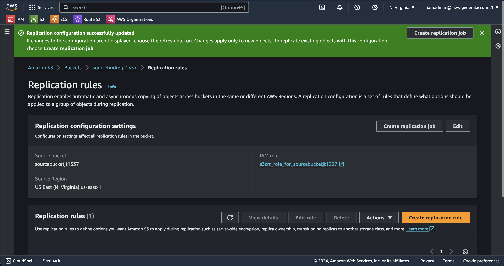
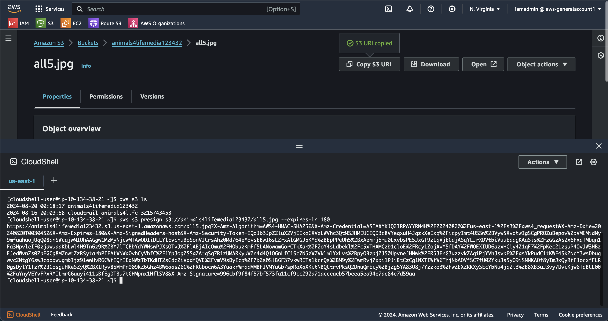
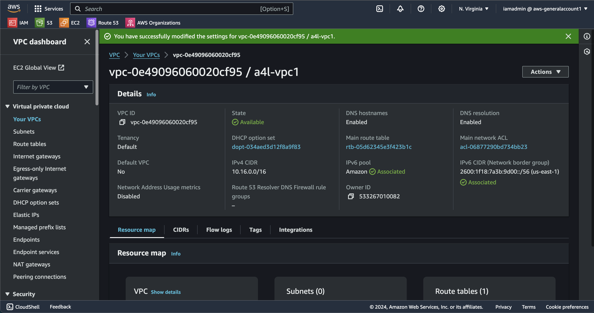
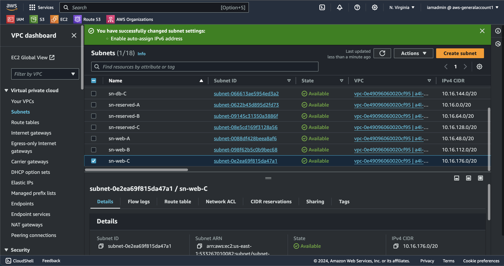

# AWS Solutions Architect - Associate Course Project Documentation

This repository documents my journey through the AWS Solutions Architect - Associate (SAA-C03) certification course. Each lesson includes practical steps, challenges, and solutions, along with relevant screenshots and code snippets. Below is a summary of the lessons completed.

---

## Lessons

### **Lesson 1: Learning and Setting Up MFA for the Root User**
- Enabled Multi-Factor Authentication (MFA) for the root user.
- Learned the benefits of MFA authentication for securing AWS accounts.

---

### **Lesson 2: Creating AWS Budgets for Accounts**
- Created cost and usage budgets for AWS accounts.
- Set up alerts to monitor spending and avoid unexpected charges.

---

### **Lesson 3: Setting Up IAM Accounts for General Access & Production Accounts**
- Created IAM users for general and production access.
- Applied custom role-based admin policies and enabled MFA.
- Avoided using the root user account for daily operations.

---

### **Lesson 4: Setting Up IAM Credentials Using CLI**
- Installed and configured AWS CLI.
- Set up IAM user credentials for CLI access.

---

### **Lesson 5: Provisioned EC2 Instance and Accessed It with SSH Client**
- Launched an EC2 instance using Amazon Linux.
- Accessed the instance via SSH.

---

### **Lesson 6: Created a Simple S3 Bucket and Uploaded Objects**
- Created an S3 bucket.
- Uploaded objects to the bucket.

  

---

### **Lesson 7: Used CloudFormation to Create and Delete an EC2 Instance**
- Created a CloudFormation template to automate EC2 instance creation and deletion.
- Tested the template's portability across environments.

  

---

### **Lesson 8: Created an EC2 Instance and Configured a CPU Utilization CloudWatch Alarm**
- Launched an EC2 instance.
- Set up a CloudWatch alarm to monitor CPU utilization.

---

### **Lesson 9: Created an IAM User and Experimented with Assigning Permissions**
- Created an IAM user and assigned permissions to two S3 buckets.
- Used inline and managed policies.

---

### **Lesson 10: Created an Organization for the Animals4Life Business**
- Created an AWS Organization with the GENERAL account as the master.
- Invited PRODUCTION and DEVELOPMENT accounts as members.
- Created an **OrganizationAccountAccessRole** to switch between accounts.

---

### **Lesson 11: Updated the Organization Structure and Applied SCPs**
- Updated the organization structure.
- Applied Service Control Policies (SCPs) to restrict actions in the PRODUCTION account.

---

### **Lesson 12: Used S3 to Create a Static Website**
- Created an S3 bucket to host a static website showcasing Animals4Life's top 10 animals.
- Made the website publicly accessible.

---

### **Lesson 13: Explored Object Versioning in S3**
- Enabled object versioning on an S3 bucket.
- Uploaded multiple versions of objects to test versioning.

---

### **Lesson 14: Enabled Accelerated Transfer on an S3 Bucket**
- Enabled S3 Transfer Acceleration.
- Compared direct uploads vs. accelerated transfers using AWS-provided tools.

---

### **Lesson 15: Created and Configured a KMS Key**
- Created a KMS key and alias.
- Used AWS CLI to encrypt and decrypt data.

---

### **Lesson 16: Uploaded Images to S3 Using Different Encryption Methods**
- Created an S3 bucket and uploaded images using server-side and client-side encryption.

---

### **Lesson 17: Configured Cross-Region Replication (CRR) Between S3 Buckets**
- Created two S3 buckets in different regions.
- Set up CRR to replicate data between the buckets.

---

### **Lesson 18: Generated a Presigned URL for an S3 Object**
- Created a presigned URL to allow unauthenticated access to an S3 object.

---

### **Lesson 19: Implemented the VPC Shell for Animals4Life**
- Created a VPC shell for the Animals4Life organization.
- Configured subnets and route tables.

  

---

### **Lesson 20: Implemented Multi-Tier Subnet Design with IPv6**
- Configured public and private subnets with IPv6 support.

---

### **Lesson 21: Configured Internet Gateway and Route Tables**
- Set up an internet gateway and route tables for public subnets.

---

### **Lesson 22: Implemented NAT Gateway for High Availability**
- Created NAT Gateways across multiple Availability Zones (AZs).
- Configured route tables to route traffic through NAT Gateways.

---

### **Lesson 23: Created and Mounted an EBS Volume**
- Attached an EBS volume to an EC2 instance.
- Tested data migration and snapshot replication.

---

### **Lesson 24: Installed WordPress on an EC2 Instance**
- Manually installed WordPress on an EC2 instance.
- Installed MariaDB, Apache, and WordPress libraries.

  

---

### **Lesson 25: Created and Used Custom AMIs**
- Created a custom AMI from a configured EC2 instance.
- Launched new EC2 instances using the custom AMI.

---

### **Lesson 26: Created a Docker Image and Uploaded to DockerHub**
- Created a Docker image for the "container of cats" application.
- Uploaded the image to DockerHub.

---

### **Lesson 27: Deployed a Fargate Cluster**
- Created a Fargate cluster and deployed the "container of cats" application.

---

### **Lesson 28: Bootstrapped EC2 Instances with WordPress**
- Bootstrapped EC2 instances using User Data and CloudFormation.

---

### **Lesson 29: Enhanced EC2 Bootstrapping with CFN-INIT and CFN-SIGNAL**
- Used CFN-INIT and CFN-SIGNAL to improve EC2 bootstrapping.

---

### **Lesson 30: Created an EC2 Instance Role**
- Created an IAM role for EC2 instances.
- Applied the role to an EC2 instance and interacted with instance metadata.

---

### **Lesson 31: Worked with Parameter Store**
- Created parameters in the Parameter Store.
- Accessed parameters via the CLI.

---

### **Lesson 32: Installed and Configured the CloudWatch Agent**
- Installed the CloudWatch Agent on an EC2 instance.
- Configured the agent to capture logs and metrics.

---

### **Lesson 33: Created Failover Routing and Private Hosted Zones**
- Configured Route 53 for failover routing and private hosted zones.

---

### **Lesson 34: Migrated WordPress Database to MariaDB on EC2**
- Migrated the WordPress database to a dedicated MariaDB instance on EC2.

---

### **Lesson 35: Migrated WordPress Database to RDS**
- Created an RDS MySQL instance and migrated the WordPress database.

---

### **Lesson 36: Worked with RDS Multi-AZ and Snapshots**
- Configured RDS Multi-AZ and performed snapshot restores.

---

### **Lesson 37: Implemented EFS for Shared File Storage**
- Created an EFS file system and mounted it on multiple EC2 instances.

---

### **Lesson 38: Updated WordPress Architecture with EFS**
- Moved WordPress `wp-content` to EFS for scalability.

---

### **Lesson 39: Configured Session Stickiness with ALB**
- Configured session stickiness for an Application Load Balancer (ALB).

---

### **Lesson 40: Implemented CloudFront with S3 Origin**
- Created a CloudFront distribution using an S3 bucket as the origin.

---

### **Lesson 41: Added Alternate Domain Name and HTTPS to CloudFront**
- Configured an alternate domain name and enabled HTTPS using ACM.

---

### **Lesson 42: Secured S3 Origin with Origin Access Control (OAC)**
- Configured OAC for a CloudFront distribution and updated the S3 bucket policy.

---

### **Lesson 43: Created an Interface Endpoint for EC2 Instance Connect**
- Created an interface endpoint to connect to private EC2 instances.

---

### **Lesson 44: Implemented a Gateway Endpoint for S3**
- Created a gateway endpoint to allow private VPC access to S3.

---

### **Lesson 45: Created an Egress-Only Internet Gateway**
- Configured an egress-only internet gateway for IPv6 traffic.

---

### **Lesson 46: Worked with VPC Peering Connections**
- Created a VPC peering connection between two VPCs.

---

### **Lesson 47: Used Amazon Macie to Identify Sensitive Data in S3**
- Configured Amazon Macie to detect sensitive data in an S3 bucket.

---

### **Lesson 48: Converted Non-Portable CloudFormation Templates**
- Updated non-portable CloudFormation templates to make them reusable.

---

### **Lesson 49: Used Athena to Query OpenStreetMap Data**
- Used Athena to query OpenStreetMap data for local animal vet facilities.

---

### **Lesson 50: Final Project - Comprehensive Architecture**
- Combined all lessons to design and implement a scalable, secure, and cost-effective architecture for Animals4Life.
---

For a detailed breakdown of challenges, skills learned, and my conclusion, check out [challenges.md](challenges.md).